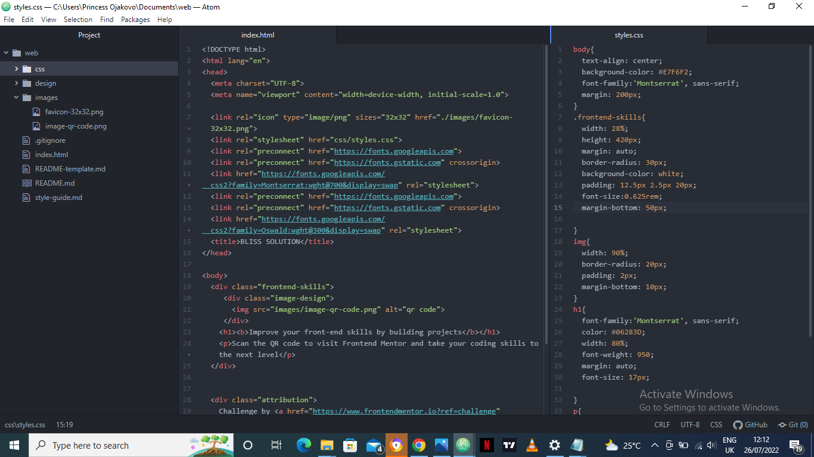

## Table of contents

[Overview]
[Screenshot]
[Links]
[Built with]
[Useful resources](#useful-resources)
[Author](#author)
[Acknowledgments](#acknowledgments)

## Overview
	This website contains the solution of my challenge from frontend Mentor as a newbie. 
	The website contains a vary of CSS and HTML codes only as instructed by the challenger.

### Screenshot
	I have a few screenshots of the major codes used in the website.
	.
	.

### Links
- Solution URL:(https://jinndu.github.io/CHALLENGE-1)
- Live Site URL:(https://docs.github.com/)

	
### Built with
- Semantic HTML5 markup
- CSS custom properties

### Useful resources
- [Example resource 1](https://developer.mozilla.org/) - This helped me remember how the font-weight css property worked.

## Author
- Website - [Jinndu](https://www.your-site.com)
- Frontend Mentor - [@Jinndu](https://www.frontendmentor.io/profile/Jinndu)
- Twitter - [@AngeloBliss05](https://www.twitter.com/AngeloBliss05)

